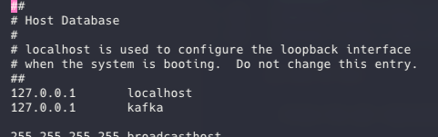

<h1 align="center">
  Spring Boot with Kafka - Messaging
</h1>

<p align="center">
<a href="https://twitter.com/genorchiomento" target="_blank">
      
</a>


</p>

Demo for messaging with Spring Boot and Kafka.

## Technologies

&nbsp;
&nbsp;
&nbsp;

## How to Run

- Clone the git repository:

```
git clone https://github.com/genorchiomento/kafka-spring-boot.git
```

- Add Host to Docker Container

```
sudo vim /etc/hosts
```

- Add hostname 'kafka'

```
127.0.0.1       kafka
```


- Run docker

```
docker-compose up -d
```

- Build the project:

```
./gradlew clean build
```

- Execute:

```
java -jar ./build/libs/kafka-spring-boot-0.0.1-SNAPSHOT.jar
```

- Test

```
http kafka:8080/kafka/hello/{name}
```

- Response

```
Ok! It's works!
```